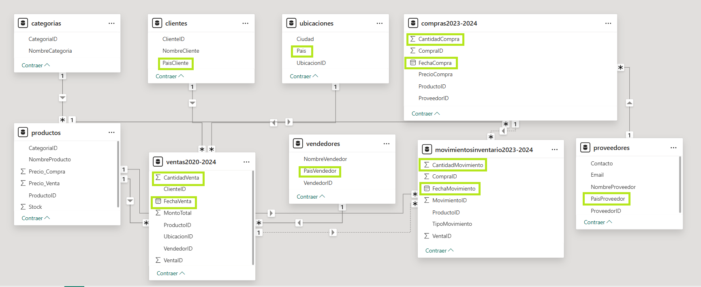
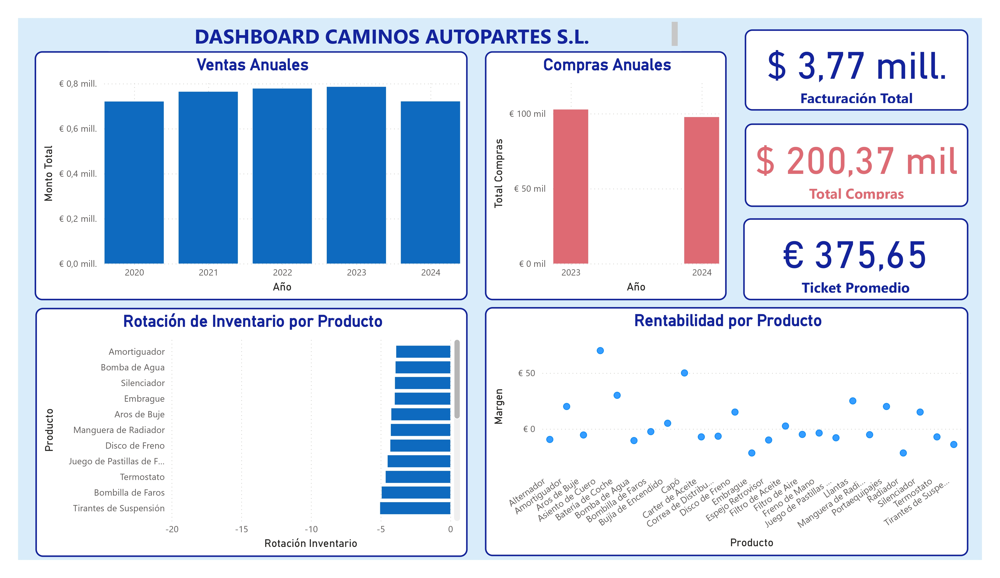

# Automotive Supply Chain & Commercial BI System

[](https://powerbi.microsoft.com/)
[](https://www.python.org/)
[](https://pandas.pydata.org/)
[](https://docs.pytest.org/)
[](https://learn.microsoft.com/dax/)
[](#data-architecture--dimensional-model)

An end-to-end Business Intelligence System developed for **Caminos Autopartes S.L.**, a synthetic enterprise case study representing an automotive spare parts distributor. The project simulates real-world enterprise operations, covering the entire lifecycle: data ingestion from heterogeneous sources (MySQL, CSV, JSON), an automated ETL pipeline implemented in Python, dimensional modeling under a Multi-Fact Constellation Schema, business logic engineering in DAX, and executive reporting in Power BI.

---

## 📌 Executive Overview

### Situation
In dynamic distribution operations, sales, procurement, and warehouse transactions are frequently siloed across transactional relational databases, manual purchase sheets, and semi-structured inventory feeds. In this case study, **Caminos Autopartes S.L.** faced missing pricing records in historical purchase orders and lacked an integrated view of margin contribution, stock turnover, and supplier performance.

### Task
Design and deploy a complete Business Intelligence system to:
1. Ingest simulated multi-source business data (relational MySQL database, procurement CSVs, and nested JSON inventory logs).
2. Automate data extraction, cleaning, and foreign-key price imputation using a modular Python pipeline.
3. Validate data transformations and calculations through automated parity unit tests.
4. Architect an analytical dimensional model (**Multi-Fact Constellation Schema**) in Power BI with optimized relationship cardinalities.
5. Engineer analytical business measures using DAX to track commercial revenue, procurement spend, and inventory turnover.

### Action
* **Automated Data Engineering (`src/etl.py`):** Built a modular Python ETL engine using Pandas to normalize JSON structures, resolve schema variations, and impute missing historical purchase values (`PrecioCompra`) via catalog lookups.
* **Automated Parity Testing (`tests/test_etl_parity.py`):** Implemented unit tests with Pytest to guarantee imputation idempotency, relational consistency, and parity between raw and processed business figures.
* **Dimensional Data Modeling:** Implemented a **Multi-Fact Constellation Schema** in Power BI, connecting transactional facts (`ventas2020-2024`, `compras2023-2024`) with core dimension tables (`productos`, `clientes`, `vendedores`, `proveedores`, `ubicaciones`, `categorias`).
* **Analytical DAX Formulation (`dax/`):** Created version-controlled analytical measures for cumulative sales, dynamic average ticket size, annual procurement budget execution, and inventory rotation velocity (`RotacionInventario`).
* **Report Delivery:** Designed an executive dashboard consolidating sales, costs, stock rotation, and product profitability tiers.

### Result
* Delivered a unified semantic model consolidating **€3.77M** in multi-year revenue and **€200.37k** in purchasing volume.
* Enabled automated stock health tracking to pinpoint capital tied up in slow-moving spare parts versus high-velocity consumables.
* Established an extensible, production-ready BI pipeline that decouples heavy transformation logic from front-end visuals.

---

## 🏛️ Data Architecture & Dimensional Model

To support concurrent analytical queries across Procurement, Sales, and Warehouse movements, the dimensional layer implements a **Multi-Fact Constellation Schema** (Galaxy Schema) with a snowflake hierarchy for product categories:

<p align="center">
  
</p>

* **Conformed Dimensions:** Tables such as `productos`, `vendedores`, `proveedores`, `ubicaciones`, and `clientes` serve as single sources of truth across distinct operational processes.
* **Granular Transactional Facts:** 
  * `ventas2020-2024`: Captures sales orders, quantities, and transaction totals.
  * `compras2023-2024`: Tracks acquisition prices, supplier fulfillment, and procurement volumes.
  * `movimientosinventario2023-2024`: Ledger recording stock movements, linkable to sales dispatches and purchase entries.
* **Filter Propagation & Cardinality:** All dimension-to-fact relationships enforce one-to-many (`1:*`) single-direction filtering to avoid ambiguous evaluation paths and circular dependencies in DAX.

---

## 📊 Executive Dashboard & Key Metrics

<p align="center">
  
</p>

* **Commercial Trajectory**: Historical gross revenue (€3.77M, 2020–2024) and transaction value averaging €375.65 across product lines.
* **Procurement Expenditure:** Longitudinal visibility into purchasing outlays across suppliers (€200.37k).
* **Inventory Rotation:** Turnover ratios per SKU to mitigate overstock risks and prevent stockouts.
* **Margin Categorization:** Rule-based classification of components into High, Medium, and Low profitability brackets to guide sales strategy.

---

## 📂 Repository Organization

```text
automotive-supplychain-bi-system/
├── .env.example              # Template for environment variables
├── .gitattributes            # Line ending normalization and binary tracking
├── .gitignore                # Comprehensive exclusions (data, venv, caches)
├── requirements.txt          # Production and testing dependencies
├── pytest.ini                # Pytest configuration (PYTHONPATH resolution)
├── README.md
├── data/
│   ├── raw/                  # Local CSV and JSON files (excluded by .gitignore)
│   │   └── .gitkeep
│   └── processed/            # Tables cleaned up by Python (excluded by .gitignore)
│       └── .gitkeep
├── dax/
│   └── business-measures.dax # DAX Catalog Versioned in Plain Text
├── reports/
│   ├── caminos-autopartes-bi-model.pbix # PBIX file with model and dashboard
│   └── figures/
│       ├── executive-dashboard.pdf  
|       ├── executive-dashboard.jpg                # Screenshot of the dashboard
│       └── constellation-schema-model.png         # Screenshot of the relational model
├── src/
│   ├── __init__.py           # Package marker
│   ├── config.py             # Dynamic paths and environment variables
│   └── etl.py                # Python Pipeline with Imputation and Calculations
└── tests/
    ├── __init__.py           # Package marker
    └── test_etl_parity.py    # Unit Test for Transformation Parity
```
---

## 🚀 Reproduction & Setup

### 1. Data Pipeline Execution (Python ETL)
Prerequisites: Python 3.11+, Power BI Desktop (to inspect .pbix).

```bash
# Clone the repository
git clone [https://github.com/carladdm/automotive-supplychain-bi-system.git](https://github.com/carladdm/automotive-supplychain-bi-system.git)
cd automotive-supplychain-bi-system

# Create and activate a virtual environment
python -m venv .venv
source .venv/bin/activate  # On Windows: .venv\Scripts\activate

# Install dependencies and execute the ETL pipeline
pip install --upgrade pip
pip install -r requirements.txt
python -m src.etl
```

### 2. Code Quality & Test Validation
```bash
# Run unit and parity tests
pytest -v

# Run code format and linter checks
black --check src/ tests/
flake8 src/ tests/
```

### 3. Analytical Model Exploration (Power BI)
* Launch Power BI Desktop.  
* Open reports/caminos_autopartes_bi_model.pbix to explore the semantic Multi-Fact Constellation Schema, evaluate DAX measures, and interact with the executive canvas visuals.

---

## 🗺️ Engineering Roadmap

* **Dimensional Governance:** Establish a conformed `Dim_Calendario` to unify cross-table Time Intelligence; denormalize `Dim_Categorias` into `Dim_Productos` to ensure strict single-direction filter propagation.
* **CI/CD Automation:** Implement GitHub Actions workflows to automate `black`, `flake8`, and `pytest` execution on branch integration.

---

## 👤 Author & Maintainer

**Carla Di Monno**  Data Scientist | M.Sc. in Data Science & Big Data - Chemical Engineer  

[](https://github.com/carladdm)
[](https://www.linkedin.com/in/ing-carladimonno)